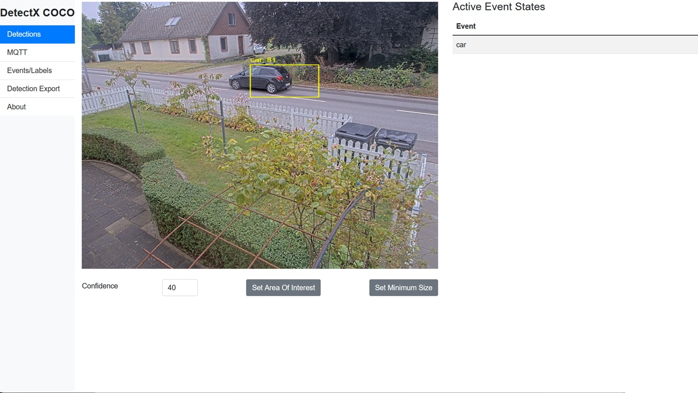
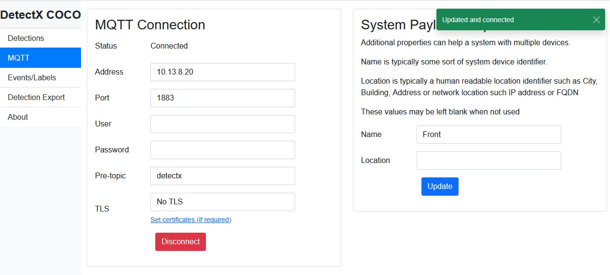

# HandGesture

On-camera hand gesture recognition for Axis cameras with **ARTPEC-8** and **ARTPEC-9**
chipsets. Detections are published over MQTT, ONVIF events and HTTP for
machine-to-machine use.

HandGesture is a variation of [DetectX](https://github.com/pandosme/DetectX). Where
DetectX runs one model per frame, HandGesture runs **two**, and that difference is
what gives it range.

---

## How the detection works

Recognising a gesture is really two different problems, and they want opposite things
from an image.

* **Finding a hand** needs resolution, not depth. A hand is a distinctive blob; a small
  network finds it reliably even when it is only a handful of pixels across.
* **Reading a gesture** needs detail, not field of view. Telling `three` from `four`
  means resolving individual fingers.

A single model has to compromise between the two. HandGesture splits them:

```
     camera frame (1280x720)
              │
              ▼
   ┌──────────────────────────┐
   │ STAGE 1 - hand detector  │   YOLOv8n, 1 class, 1280x736
   │ "where are the hands?"   │   anchor-free, 19 320 anchors
   └──────────────────────────┘
              │  0-N boxes
              ▼
    crop each hand from the full-resolution buffer,
    square, 1.25x margin, scale to 128x128
              │
              ▼
   ┌──────────────────────────┐
   │ STAGE 2 - classifier     │   YOLOv8n-cls, 19 classes, 128x128
   │ "which gesture is it?"   │   runs once per detected hand
   └──────────────────────────┘
              │
              ▼
     label + confidence  ->  MQTT / ONVIF / HTTP
```

Stage 2 sees a crop scaled up so the hand fills the frame — the same view the
classifier was trained on — regardless of how far away the person is. That is the
whole point: a hand 30 px wide in the scene becomes a 128 px input to the classifier.

Stage 2 runs **after** non-maximum suppression, so each surviving hand is classified
exactly once. It costs little: under 1 GFLOP against stage 1's 20, and it fires only
when a hand is present. The crop is taken from the RGB buffer already prepared for
stage 1, so there is no second video stream.

Each detection carries the gesture in `label` and the classifier's confidence in `c`.
The detector's own score is preserved as `hand_c`, so you can tell "I am sure that is
a hand but unsure which gesture" from "I am unsure there is a hand at all".

### Recognised gestures

The 18 gestures of HaGRID v1, plus `no_gesture`:

```
call      dislike   fist            four       like
mute      ok        one             palm       peace
rock      stop      three           three2     two_up
peace_inverted      stop_inverted   two_up_inverted     no_gesture
```

`no_gesture` is the rejection class. Without it every idle hand would be forced into
some gesture, and the application would fire constantly. Expect to see it often.

Most installations act on a handful of gestures. The model reports all 19 and the
application filters — that is deliberate, so the gesture set can change without
retraining.

### Range

Detection range is set by how many pixels the hand covers at the network input.
Measured on the validation set:

| hand size at input | stage 1 recall | stage 2 top-1 | combined per frame |
|---|---|---|---|
| 40 px | 0.997 | 0.995 | 99.2 % |
| 24 px | 0.992 | 0.990 | 98.2 % |
| 20 px | 0.964 | 0.986 | 95.1 % |
| 16 px | 0.927 | 0.973 | 90.2 % |

With a 1280-wide input and a 90° lens that is roughly **4 m** at 95 % per frame. A
narrower lens or a higher-resolution model input extends it proportionally — pixels on
the hand are what matter, not the model size.

Per-frame accuracy is not the whole story. A gesture is held for about a second, so at
5-6 fps you get 5-6 independent reads. Requiring the same gesture on several
consecutive frames raises effective reliability well above the per-frame figure, and
the application's event stabilisation does exactly that.

These numbers come from downscaled dataset images, which are cleaner than a real
camera frame: no motion blur, no compression artefacts, subject facing the camera.
Treat them as an optimistic ceiling.

---

## Performance

Measured on a Q3536-LVE (ARTPEC-8, OS 12.11.77), both stages plus pre- and
post-processing:

| Chip | Model input | Time per frame |
|---|---|---|
| ARTPEC-8 | 1280x736 | **~175 ms** (≈5.7 fps) |
| ARTPEC-9 | 1280x736 | not yet measured |

---

## Requirements

* Axis camera with ARTPEC-8 or ARTPEC-9 and a DLPU
* **ARTPEC-9 requires Axis OS 13 or later.** Earlier firmware miscomputes YOLOv8 on the
  A9 DLPU: the model loads and runs at full speed but returns high-confidence garbage,
  while the identical package is correct on ARTPEC-8.

### The two packages are not interchangeable

ARTPEC-8 requires **per-tensor** weight quantization; ARTPEC-9 uses **per-channel**.
Install the package that matches the chip:

| Package | Chip |
|---|---|
| `HandGesture_<version>_artpec8.eap` | ARTPEC-8 |
| `HandGesture_<version>_artpec9.eap` | ARTPEC-9 |

---

## Quick start

### Install a pre-built package

Upload the `.eap` for your chip through the camera web interface:
**Settings → Apps → Add**, then Start. Or:

```sh
export AXIS_USER=youruser
read -rs AXIS_PASS && export AXIS_PASS
./install.sh <camera-host> a8      # or a9
```

### Build from source

```sh
./build.sh                 # both chips
./build.sh --target a8     # one chip
```

Builds run in Docker with the Axis ACAP SDK and produce one `.eap` per chip. Model
parameters — input size, tensor shapes, quantization scales — are extracted from the
TFLite files at build time, so nothing needs editing by hand.

---

## Models

Packaged, ready to run:

| File | Purpose | Input | Output |
|---|---|---|---|
| `app/model/model-a8.tflite` / `-a9` | stage 1 detector | `[1,736,1280,3]` uint8 | `[1,4,19320]` + `[1,1,19320]` uint8 |
| `app/model/gesture-a8.tflite` / `-a9` | stage 2 classifier | `[1,128,128,3]` uint8 | `[1,19]` uint8 |

Both are full-INT8 with uint8 input and output. The detector emits **two** tensors,
coordinates and scores separately, rather than one fused tensor — see
[docs/MODEL_QUANTIZATION.md](docs/MODEL_QUANTIZATION.md) for why that matters.

### Model checkpoints

The PyTorch checkpoints these were exported from are in [`models/`](models/), with a
full description of how each was trained, what it is good at and where it falls down:

| File | |
|---|---|
| `models/stage1_hand_yolov8n.pt` | detector, mAP50 0.995 / mAP50-95 0.886 |
| `models/stage2_gesture_yolov8n_cls.pt` | classifier, top-1 0.996 |

Both were trained on [HaGRID](https://github.com/hukenovs/hagrid). The detector uses
HaGRIDv2's 34 gesture classes collapsed into a single `hand` class; the classifier uses
HaGRID v1's 18 gestures plus `no_gesture`.

**Training is not part of this repository.** HandGesture is the application. For
training and export tooling, see [DetectX](https://github.com/pandosme/DetectX).

---

## Configuration



**Detections** — live view with bounding boxes, confidence threshold, area of
interest and minimum size filters.

**Events/Labels** — which gestures fire events, plus stabilisation time and minimum
duration. Stabilisation is what turns per-frame classifications into stable events;
raise it if you see flicker.


**MQTT** — broker address, credentials, TLS and topic prefix.



**Detection Export** — publish cropped detection images over MQTT or HTTP, or capture
them to SD card for building a retraining set.


**About** — model state, average inference time and the active DLPU backend. Check
here first if something is wrong.


---

## Integration

All payloads carry the configured device name, location and serial.

### Detection over MQTT

Topic `handgesture/detection/<serial>`

```json
{
  "detections": [
    {
      "label": "peace",
      "c": 92,
      "hand_c": 88,
      "x": 274, "y": 224, "w": 180, "h": 104,
      "timestamp": 1756453942980,
      "refId": 260
    }
  ],
  "name": "Office", "location": "", "serial": "B8A44F3024BB"
}
```

`label` and `c` are the gesture and its confidence; `hand_c` is the detector's
confidence that this is a hand at all. Coordinates are in a 0-1000 normalised space.

### Event state over MQTT or ONVIF

Topic `handgesture/event/<serial>/<label>/<state>`

```json
{
  "label": "peace",
  "state": true,
  "timestamp": 1756453946184,
  "name": "Office", "location": "", "serial": "B8A44F3024BB"
}
```

ONVIF topic: `tnsaxis:CameraApplicationPlatform/handgesture/<gesture>`, with a boolean
`state`. One topic is declared per gesture, so a camera rule can trigger on a single
gesture without any parsing.

### Detection crop

Topic `handgesture/crop/<serial>` — a base64 JPEG of the detection with its bounding
box, label and confidence.

---

## Troubleshooting

| Symptom | Cause |
|---|---|
| High-confidence nonsense on ARTPEC-9 | Firmware older than Axis OS 13 |
| Wrong or unstable detections | Wrong package for the chip — check artpec8 vs artpec9 |
| Hands found but every label wrong | Stage 2 failed to load; check the log for `Stage 2 ready` |
| `Stage 2 ... not present, running single-tier` | The gesture model is missing from the package |
| Gestures flicker between two labels | Raise the event stabilisation time |
| Nothing detected at distance | The hand is below ~16 px at the model input; use a narrower lens |

```sh
journalctl -f -u handgesture          # on the camera
```

A healthy start logs `Stage 2 ready: 19 gestures at 128x128`.

---

## Version history

### 4.0.0

First two-tier release, and a clean break from the 3.x line.

* **Two-stage detection.** A YOLOv8 hand detector feeds a YOLOv8 gesture classifier.
  3.x used a single YOLOv5 model that had to locate and classify at once.
* **YOLOv8 replaces YOLOv5.** Anchor-free head, two output tensors instead of one
  fused tensor, no objectness column. **3.x models will not run on 4.x.**
* **Separate ARTPEC-8 and ARTPEC-9 packages**, per-tensor and per-channel quantized
  respectively. Previously one package served both.
* Built against the current Axis ACAP SDK; manifest schema 2.2.0, `runMode: respawn`,
  DLPU declared as a required resource.
* 19 gestures (HaGRID v1 plus `no_gesture`), each with its own ONVIF event topic.
* Model checkpoints published in `models/`, with their training described.
* **Requires Axis OS 13 or later on ARTPEC-9.**

### 3.5.4 and earlier

Single-stage YOLOv5 releases. See the repository history.

---

## License

MIT — see [LICENSE](LICENSE).
